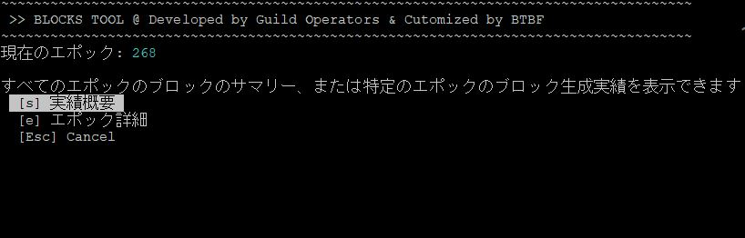
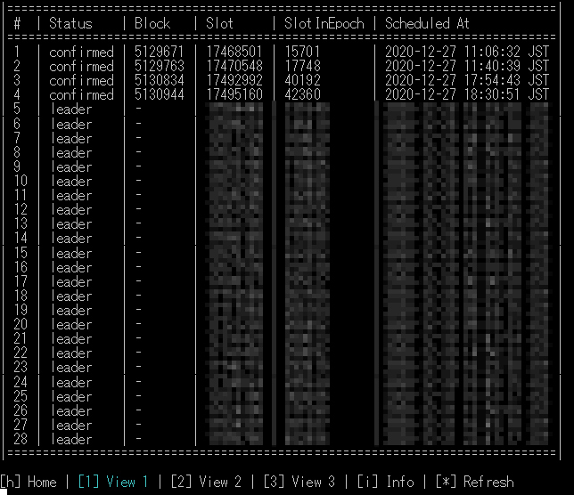

# ステークプールブロックログ導入手順


最終更新日：2021/5/19 7:00  


## 🎉 ∞ お知らせ


このツールは海外ギルドオペレーター制作の[CNCLI By AndrewWestberg](https://github.com/AndrewWestberg/cncli)、[logmonitor by Guild Operators](https://cardano-community.github.io/guild-operators/#/Scripts/logmonitor)、[Guild LiveView](https://cardano-community.github.io/guild-operators/#/Scripts/gliveview)、[BLOCK LOG for CNTools](https://cardano-community.github.io/guild-operators/#/Scripts/cntools)を組み合わせたツールとなっております。カスタマイズするにあたり、開発者の[AHLNET(AHL)](https://twitter.com/olaahlman)にご協力頂きました。ありがとうございます。



## 🏁 0. 前提条件
###  稼働ノード
* **BPノード限定**

###  稼働要件
* ４つのサービス(プログラム)をsystemd × tmuxにて常駐させます。
* ブロックチェーン同期用DBを新しく設置します(sqlite3)
* 日本語マニュアルのフォルダ構成に合わせて作成されています。
* vrf.skey と vrf.vkeyが必要です。

###  ハードウェア最小構成
* **オペレーティング・システム:** 64-bit Linux \(Ubuntu 20.04 LTS\)
* **プロセッサー:** 1.6GHz以上(ステークプールまたはリレーの場合は2Ghz以上)の2つ以上のコアを備えたIntelまたはAMD x86プロセッサー
* **メモリ**：8GB  
* **SSD**：50GB以上

###  インストール及びダウンロードツール内容

* **CNCLI (依存プログラム含む)**　(コミュニティ製Cardano CLI)
* **sqlite3** (データベースソフト)
* **logmonitor.sh** (ノードログ抽出プログラム)
* **block.sh**　(ブロックログ表示ブログラム)
* **cncli.sh**　(CNCLI操作用プログラム)
* **cntools.config** (設定ファイル)
* **cntools.library**　(ライブラリファイル)
* **env** (設定ファイル)
* **gLiveView.sh** (ノード監視ツール)
 



## 🏁 1. CNCLIをインストールする


[AndrewWestberg](https://twitter.com/amw7)さんによって開発された[CNCLI](https://github.com/AndrewWestberg/cncli)はプールのブロック生成スケジュールを算出ツールを開発し、Shelley期におけるSPOに革命をもたらしました。

  
RUST環境を準備します

```bash
mkdir $HOME/.cargo && mkdir $HOME/.cargo/bin
chown -R $USER $HOME/.cargo
touch $HOME/.profile
chown $USER $HOME/.profile
```

rustupをインストールします-デフォルトのインストールを続行します（オプション1）
```bash
curl --proto '=https' --tlsv1.2 -sSf https://sh.rustup.rs | sh
```

1) Proceed with installation (default)  1を入力してEnter

```bash
source $HOME/.cargo/env
rustup install stable
rustup default stable
rustup update
rustup component add clippy rustfmt
```

依存関係をインストールし、cncliをビルドします

```bash
source $HOME/.cargo/env
sudo apt-get update -y && sudo apt-get install -y automake build-essential pkg-config libffi-dev libgmp-dev libssl-dev libtinfo-dev libsystemd-dev zlib1g-dev make g++ tmux git jq wget libncursesw5 libtool autoconf
cd $HOME/git
git clone https://github.com/AndrewWestberg/cncli
cd cncli
git checkout v2.1.1
cargo install --path . --force
```

CNCLIのバージョンを確認します。
```bash
cncli --version
```


### 1-1. CNCLI更新手順
**以下は最新版がリリースされた場合に実行してください**  

cncli旧バージョンからの更新手順


１時間以内にブロック生成スケジュールがないことを確認してから、以下を実施してください


```bash
rustup update
cd $HOME/git/cncli
git fetch --all --prune
git checkout v3.0.0
cargo install --path . --force
```
バージョンを確認する
```
cncli --version
```

ノードを再起動する
```bash
sudo systemctl reload-or-restart cardano-node
```
> ノードが同期したことを確認する

```
tmux a -t cncli
```
>100% syncedになったことを確認する

各サービスを表示し、envまたはcncli.shのアップデートメッセージがある場合は"n"で拒否
```
tmux a -t leaderlog
tmux a -t validate
```
> envまたはcncli.shのアップデートが必要になった場合は改めてアナウンスします。




## 🏁 2. sqlite3をインストールする
```bash
sudo apt install sqlite3
sqlite3 --version
```
3.31.1以上のバージョンがインストールされたらOKです。


## 🏁 3. 各種ファイルをダウンロードする

依存関係のあるプログラムをダウンロードします。


海外のギルドオペレーターによって開発された革新的な各種ツールです。


```bash
cd $NODE_HOME
mkdir scripts
cd $NODE_HOME/scripts
wget -N https://raw.githubusercontent.com/cardano-community/guild-operators/master/scripts/cnode-helper-scripts/cncli.sh
wget -N https://raw.githubusercontent.com/cardano-community/guild-operators/master/scripts/cnode-helper-scripts/cntools.config
wget -N https://raw.githubusercontent.com/btbf/coincashew/master/guild-tools/cntools.library
wget -N https://raw.githubusercontent.com/cardano-community/guild-operators/master/scripts/cnode-helper-scripts/env
wget -N https://raw.githubusercontent.com/cardano-community/guild-operators/master/scripts/cnode-helper-scripts/logMonitor.sh
wget -N https://raw.githubusercontent.com/cardano-community/guild-operators/master/scripts/cnode-helper-scripts/gLiveView.sh
wget -N https://raw.githubusercontent.com/btbf/coincashew/master/guild-tools/blocks.sh
```

###  3-1.パーミッションを設定する
```bash
chmod 755 cncli.sh
chmod 755 logMonitor.sh
chmod 755 gLiveView.sh
chmod 755 blocks.sh
cd ../
chmod 400 vrf.vkey
```

###  3-2.設定ファイルを編集する

envファイルを編集します

```bash
cd scripts
nano env
```

ファイル内上部にある設定値を変更します。  
先頭の **#** を外し、ご自身の環境に合わせ**user_name**パスやファイル名、ポート番号を設定します。  
下記以外の**#**がついている項目はそのままで良いです。
```bash
CCLI="/usr/local/bin/cardano-cli"
CNODE_HOME=/home/<user_name>/cardano-my-node
CNODE_PORT=6000
CONFIG="${CNODE_HOME}/mainnet-config.json"
SOCKET="${CNODE_HOME}/db/socket"
BLOCKLOG_TZ="Asia/Tokyo"
```

cncli.shファイルを編集します。

```bash
nano cncli.sh
```

ファイル内の設定値を変更します。  
先頭の **#** を外し、ご自身の環境に合わせてプールIDやファイル名を設定します。

```bash
POOL_ID="<Pool-ID>"
POOL_VRF_SKEY="${CNODE_HOME}/vrf.skey"
POOL_VRF_VKEY="${CNODE_HOME}/vrf.vkey"
```

## 🏁 4.サービスファイル5種類を作成・登録します。

```bash
cd $NODE_HOME
mkdir service
cd service
```



```bash
cat > $NODE_HOME/service/cnode-cncli-sync.service << EOF 
# file: /etc/systemd/system/cnode-cncli-sync.service

[Unit]
Description=Cardano Node - CNCLI sync
BindsTo=cardano-node.service
After=cardano-node.service

[Service]
Type=oneshot
RemainAfterExit=yes
Restart=on-failure
RestartSec=20
User=$(whoami)
WorkingDirectory=$NODE_HOME
ExecStart=/usr/bin/tmux new -d -s cncli
ExecStartPost=/usr/bin/tmux send-keys -t cncli $NODE_HOME/scripts/cncli.sh Space sync Enter
ExecStop=/usr/bin/tmux kill-session -t cncli
KillSignal=SIGINT
RestartKillSignal=SIGINT
SuccessExitStatus=143
StandardOutput=syslog
StandardError=syslog
SyslogIdentifier=cnode-cncli-sync
TimeoutStopSec=5

[Install]
WantedBy=cardano-node.service
EOF
```



```bash
cat > $NODE_HOME/service/cnode-cncli-validate.service << EOF 
# file: /etc/systemd/system/cnode-cncli-validate.service

[Unit]
Description=Cardano Node - CNCLI validate
BindsTo=cnode-cncli-sync.service
After=cnode-cncli-sync.service

[Service]
Type=oneshot
RemainAfterExit=yes
Restart=on-failure
RestartSec=20
User=$(whoami)
WorkingDirectory=$NODE_HOME
ExecStart=/usr/bin/tmux new -d -s validate
ExecStartPost=/usr/bin/tmux send-keys -t validate $NODE_HOME/scripts/cncli.sh Space validate Enter
ExecStop=/usr/bin/tmux kill-session -t validate
KillSignal=SIGINT
RestartKillSignal=SIGINT
SuccessExitStatus=143
StandardOutput=syslog
StandardError=syslog
SyslogIdentifier=cnode-cncli-validate
TimeoutStopSec=5

[Install]
WantedBy=cnode-cncli-sync.service
EOF
```



```bash
cat > $NODE_HOME/service/cnode-cncli-leaderlog.service << EOF 
# file: /etc/systemd/system/cnode-cncli-leaderlog.service

[Unit]
Description=Cardano Node - CNCLI Leaderlog
BindsTo=cnode-cncli-sync.service
After=cnode-cncli-sync.service

[Service]
Type=oneshot
RemainAfterExit=yes
Restart=on-failure
RestartSec=20
User=$(whoami)
WorkingDirectory=$NODE_HOME
ExecStart=/usr/bin/tmux new -d -s leaderlog
ExecStartPost=/usr/bin/tmux send-keys -t leaderlog $NODE_HOME/scripts/cncli.sh Space leaderlog Enter
ExecStop=/usr/bin/tmux kill-session -t leaderlog
KillSignal=SIGINT
RestartKillSignal=SIGINT
SuccessExitStatus=143
StandardOutput=syslog
StandardError=syslog
SyslogIdentifier=cnode-cncli-leaderlog
TimeoutStopSec=5

[Install]
WantedBy=cnode-cncli-sync.service
EOF
```



```bash
cat > $NODE_HOME/service/cnode-logmonitor.service << EOF 
# file: /etc/systemd/system/cnode-logmonitor.service

[Unit]
Description=Cardano Node - CNCLI logmonitor
BindsTo=cardano-node.service
After=cardano-node.service

[Service]
Type=oneshot
RemainAfterExit=yes
Restart=on-failure
RestartSec=20
User=$(whoami)
WorkingDirectory=$NODE_HOME
ExecStart=/bin/bash -c "sleep 300;/usr/bin/tmux new -d -s logmonitor"
ExecStartPost=/usr/bin/tmux send-keys -t logmonitor $NODE_HOME/scripts/logMonitor.sh Enter
ExecStop=/usr/bin/tmux kill-session -t logmonitor
KillSignal=SIGINT
RestartKillSignal=SIGINT
SuccessExitStatus=143
StandardOutput=syslog
StandardError=syslog
SyslogIdentifier=cnode-logmonitor
TimeoutStopSec=5

[Install]
WantedBy=cardano-node.service
EOF
```




###  4-1サービスファイルをシステムフォルダにコピーして権限を付与します。  

**1行づつコマンドに貼り付けてください**
```bash
sudo cp $NODE_HOME/service/cnode-cncli-sync.service /etc/systemd/system/cnode-cncli-sync.service
sudo cp $NODE_HOME/service/cnode-cncli-validate.service /etc/systemd/system/cnode-cncli-validate.service
sudo cp $NODE_HOME/service/cnode-cncli-leaderlog.service /etc/systemd/system/cnode-cncli-leaderlog.service
sudo cp $NODE_HOME/service/cnode-logmonitor.service /etc/systemd/system/cnode-logmonitor.service
```

```bash
sudo chmod 644 /etc/systemd/system/cnode-cncli-sync.service
sudo chmod 644 /etc/systemd/system/cnode-cncli-validate.service
sudo chmod 644 /etc/systemd/system/cnode-cncli-leaderlog.service
sudo chmod 644 /etc/systemd/system/cnode-logmonitor.service
```

###  4-2サービスファイルを有効化します

```bash
sudo systemctl daemon-reload
sudo systemctl enable cnode-cncli-sync.service
sudo systemctl enable cnode-cncli-validate.service
sudo systemctl enable cnode-cncli-leaderlog.service
sudo systemctl enable cnode-logmonitor.service
```

## 🏁 5.ブロックチェーンとDBを同期する

**cncli-sync**サービスを開始し、ログ画面を表示します
```bash
sudo systemctl start cnode-cncli-sync.service
tmux a -t cncli
```


「100.00% synced」になるまで待ちます。  
100%になったら、Ctrl+bを押した後に d を押し元の画面に戻ります(バックグラウンド実行に切り替え)



## 🏁 6.過去のブロック生成実績をDBに登録します。

```bash
cd $NODE_HOME/scripts
./cncli.sh init
```


## 🏁 7.ログファイルを作成するように設定する

 ```bash
cd $NODE_HOME
nano mainnet-config.json
 ```
* defaultScribesを下記のように書き換える
 ```bash
  "defaultScribes": [
    [
      "FileSK",
      "logs/node.json"
    ],
    [
      "StdoutSK",
      "stdout"
    ]
  ],
```
* setupScribesを下記のように書き換える
 ```bash
   "setupScribes": [
    {
      "scFormat": "ScJson",
      "scKind": "FileSK",
      "scName": "logs/node.json"
    },
    {
      "scFormat": "ScText",
      "scKind": "StdoutSK",
      "scName": "stdout",
      "scRotation": null
    }
  ]
 ```
Ctrl+Oでファイルを保存し、Ctrl+Xで閉じる

ノードを再起動する
```bash
sudo systemctl reload-or-restart cardano-node
```
> cardano-nodeを再起動すると、以下サービスも連動して再起動します。  
> cnode-cncli-sync.service  
> cnode-cncli-validate.service  
> cnode-cncli-leaderlog.service  
> cnode-logmonitor.service  


tmux起動確認

```bash
tmux ls
```


5つの画面がバックグラウンドで起動中であればOKです
* cnode  
* cncli
* leaderlog
* validate
* logmonitor(5分後に遅延起動)




###  ●各種サービスをストップする方法

```bash
sudo systemctl stop cnode-cncli-sync.service
```
>上記コマンドを実行すると以下サービスも連動して止まります  
>cnode-cncli-validate.service  
>cnode-cncli-leaderlog.service  

```
sudo systemctl stop cnode-logmonitor.service
```

###  ●各種サービスを再起動する方法

```bash
sudo systemctl reload-or-restart cnode-cncli-sync.service
```
>上記コマンドを実行すると以下サービスも連動して止まります  
>cnode-cncli-validate.service  
>cnode-cncli-leaderlog.service  



###  7-1.　3プログラムのログ画面を確認します。




こちらのプログラムは生成したブロックが、ブロックチェーン上に記録されているか照合するためのプログラムです

```bash
tmux a -t validate
```
以下表示なら正常です。
```
~ CNCLI Block Validation started ~
```
  
Ctrl+bを押した後すぐにd でバックグラウンド実行に切り替えます(デタッチ)





こちらのプログラムはスロットリーダーを自動的に算出するプログラムです。  
次エポックの1.5日前になると自動的に次エポックのスロットリーダーが算出されます。


```bash
tmux a -t leaderlog
```

以下の表示なら正常です。  
スケジュール予定がある場合、表示されるまでに5分ほどかかります。

```
~ CNCLI Leaderlog started ~
```

Ctrl+bを押した後すぐにd でバックグラウンド実行に切り替えます(デタッチ)






こちらのプログラムはプールのノードログからブロック生成結果を抽出します。

```bash
tmux a -t logmonitor
```

以下の表示なら正常です。  

```
~~ LOG MONITOR STARTED ~~
monitoring logs/node.json for traces
```
Ctrl+bを押した後すぐにd でバックグラウンド実行に切り替えます(デタッチ)





## 🏁 8.ブロックログを表示する

このツールでは上記で設定してきたプログラムを組み合わせ、割り当てられたスロットリーダーに対してのブロック生成結果をデータベースに格納し、確認することができます。

```bash
cd $NODE_HOME/scripts
./blocks.sh
```



（ｓ）実績概要---エポック毎のブロック生成実績参照  
（ｅ）エポック詳細---個別エポックのブロック生成スケジュールおよび生成実績参照




ブロックステータス:  
* **Leader**   - ブロック生成予定スロット  
* **Ideal**     - アクティブステーク（シグマ）に基づいて割り当てられたブロック数の期待値/理想値  
* **Luck**      - 期待値における実際に割り当てられたスロットリーダー数のパーセンテージ  
* **Adopted**   - ブロック生成成功  
* **Confirmed** - 生成したブロックのうち確実にオンチェーンであることが検証されたブロック  set in 'cncli.sh' for 'CONFIRM_BLOCK_CNT'  
* **Missed**    - スロットでスケジュールされているが、 cncli DB には記録されておらず他のプールがこのスロットのためにブロックを作った可能性  
* **Ghosted**   - ブロックは作成されましたが「Orpah(孤立ブロック)」となっております。 スロットバトル・ハイトバトルで敗北したか、ブロック伝播の問題で有効なブロックになっていません  
* **Stolen**    - 別のプールに有効なブロックが登録されているため、スロットバトルで敗北した可能性。  
* **Invalid**   - プールはブロックの作成に失敗しました。base64でエンコードされたエラーメッセージ。次のコードでデコードできます 'echo <base64 hash> | base64 -d | jq -r' 


メニュー項目が文字化けする場合は、システム文字コードが「UTF-8」であることを確認してください。  
```bash
echo $LANG
```


## 🏁 9.gLiveViewでブロック生成サマリを確認する

```bash
cd $NODE_HOME/scripts
./gLiveView.sh
```


スクリプトへのパスを通し、任意の単語で起動出来るようにする。
```bash
echo alias blocks="$NODE_HOME/scripts/blocks.sh" >> $HOME/.bashrc
echo alias glive="$NODE_HOME/scripts/gLiveView.sh" >> $HOME/.bashrc
source $HOME/.bashrc
```

単語を入力するだけで、どこからでも起動できます。  
blocks・・・blocks.sh  
glive・・・gLiveView.sh  




## 🏁 10. 2021年5月19日以前から導入済みの方はこちら


cardano-nodeを再起動するとcncli-sync.serviceなど各サービスが落ち、個別に再起動しなければいけない不具合を解消します。  
  
▼改修後の挙動▼  
cardano-nodeを開始・再起動・停止すると各サービスも連動して開始・再起動・停止するように修正しました。


ブロック生成スケジュールに余裕がある時間帯に実施してください


### 10-1.各種サービスをストップする

```bash
sudo systemctl stop cnode-cncli-sync.service
#[パスワードを入力する]
sudo systemctl stop cnode-cncli-validate.service
sudo systemctl stop cnode-cncli-leaderlog.service
sudo systemctl stop cnode-logmonitor.service
```

### 10-2.各種サービスファイルをアップデートする

```bash
cd $NODE_HOME/service
```



```bash
cat > $NODE_HOME/service/cnode-cncli-sync.service << EOF 
# file: /etc/systemd/system/cnode-cncli-sync.service

[Unit]
Description=Cardano Node - CNCLI sync
BindsTo=cardano-node.service
After=cardano-node.service

[Service]
Type=oneshot
RemainAfterExit=yes
Restart=on-failure
RestartSec=20
User=$(whoami)
WorkingDirectory=$NODE_HOME
ExecStart=/usr/bin/tmux new -d -s cncli
ExecStartPost=/usr/bin/tmux send-keys -t cncli $NODE_HOME/scripts/cncli.sh Space sync Enter
ExecStop=/usr/bin/tmux kill-session -t cncli
KillSignal=SIGINT
RestartKillSignal=SIGINT
SuccessExitStatus=143
StandardOutput=syslog
StandardError=syslog
SyslogIdentifier=cnode-cncli-sync
TimeoutStopSec=5

[Install]
WantedBy=cardano-node.service
EOF
```



```bash
cat > $NODE_HOME/service/cnode-cncli-validate.service << EOF 
# file: /etc/systemd/system/cnode-cncli-validate.service

[Unit]
Description=Cardano Node - CNCLI validate
BindsTo=cnode-cncli-sync.service
After=cnode-cncli-sync.service

[Service]
Type=oneshot
RemainAfterExit=yes
Restart=on-failure
RestartSec=20
User=$(whoami)
WorkingDirectory=$NODE_HOME
ExecStart=/usr/bin/tmux new -d -s validate
ExecStartPost=/usr/bin/tmux send-keys -t validate $NODE_HOME/scripts/cncli.sh Space validate Enter
ExecStop=/usr/bin/tmux kill-session -t validate
KillSignal=SIGINT
RestartKillSignal=SIGINT
SuccessExitStatus=143
StandardOutput=syslog
StandardError=syslog
SyslogIdentifier=cnode-cncli-validate
TimeoutStopSec=5

[Install]
WantedBy=cnode-cncli-sync.service
EOF
```



```bash
cat > $NODE_HOME/service/cnode-cncli-leaderlog.service << EOF 
# file: /etc/systemd/system/cnode-cncli-leaderlog.service

[Unit]
Description=Cardano Node - CNCLI Leaderlog
BindsTo=cnode-cncli-sync.service
After=cnode-cncli-sync.service

[Service]
Type=oneshot
RemainAfterExit=yes
Restart=on-failure
RestartSec=20
User=$(whoami)
WorkingDirectory=$NODE_HOME
ExecStart=/usr/bin/tmux new -d -s leaderlog
ExecStartPost=/usr/bin/tmux send-keys -t leaderlog $NODE_HOME/scripts/cncli.sh Space leaderlog Enter
ExecStop=/usr/bin/tmux kill-session -t leaderlog
KillSignal=SIGINT
RestartKillSignal=SIGINT
SuccessExitStatus=143
StandardOutput=syslog
StandardError=syslog
SyslogIdentifier=cnode-cncli-leaderlog
TimeoutStopSec=5

[Install]
WantedBy=cnode-cncli-sync.service
EOF
```



```bash
cat > $NODE_HOME/service/cnode-logmonitor.service << EOF 
# file: /etc/systemd/system/cnode-logmonitor.service

[Unit]
Description=Cardano Node - CNCLI logmonitor
BindsTo=cardano-node.service
After=cardano-node.service

[Service]
Type=oneshot
RemainAfterExit=yes
Restart=on-failure
RestartSec=20
User=$(whoami)
WorkingDirectory=$NODE_HOME
ExecStart=/bin/bash -c "sleep 300;/usr/bin/tmux new -d -s logmonitor"
ExecStartPost=/usr/bin/tmux send-keys -t logmonitor $NODE_HOME/scripts/logMonitor.sh Enter
ExecStop=/usr/bin/tmux kill-session -t logmonitor
KillSignal=SIGINT
RestartKillSignal=SIGINT
SuccessExitStatus=143
StandardOutput=syslog
StandardError=syslog
SyslogIdentifier=cnode-logmonitor
TimeoutStopSec=5

[Install]
WantedBy=cardano-node.service
EOF
```




### 10-3.サービスファイルを無効化する

```bash
sudo systemctl disable cnode-cncli-sync.service
sudo systemctl disable cnode-cncli-validate.service
sudo systemctl disable cnode-cncli-leaderlog.service
sudo systemctl disable cnode-logmonitor.service
```

### 10-4.サービスファイルを入れ替える

**1行づつコマンドに貼り付けてください**
```bash
sudo cp $NODE_HOME/service/cnode-cncli-sync.service /etc/systemd/system/cnode-cncli-sync.service
sudo cp $NODE_HOME/service/cnode-cncli-validate.service /etc/systemd/system/cnode-cncli-validate.service
sudo cp $NODE_HOME/service/cnode-cncli-leaderlog.service /etc/systemd/system/cnode-cncli-leaderlog.service
sudo cp $NODE_HOME/service/cnode-logmonitor.service /etc/systemd/system/cnode-logmonitor.service
```

```bash
sudo chmod 644 /etc/systemd/system/cnode-cncli-sync.service
sudo chmod 644 /etc/systemd/system/cnode-cncli-validate.service
sudo chmod 644 /etc/systemd/system/cnode-cncli-leaderlog.service
sudo chmod 644 /etc/systemd/system/cnode-logmonitor.service
```

###  10-5.サービスファイルを有効化します

```bash
sudo systemctl daemon-reload
sudo systemctl enable cnode-cncli-sync.service
sudo systemctl enable cnode-cncli-validate.service
sudo systemctl enable cnode-cncli-leaderlog.service
sudo systemctl enable cnode-logmonitor.service
```

### 10-6.ノードを再起動する

ノードを再起動する
```bash
sudo systemctl reload-or-restart cardano-node
```

### 10-7.サービス起動確認

```bash
tmux ls
```


5つの画面がバックグラウンドで起動中であればOKです
* cnode  
* cncli
* leaderlog
* validate
* logmonitor(5分後に遅延起動)
